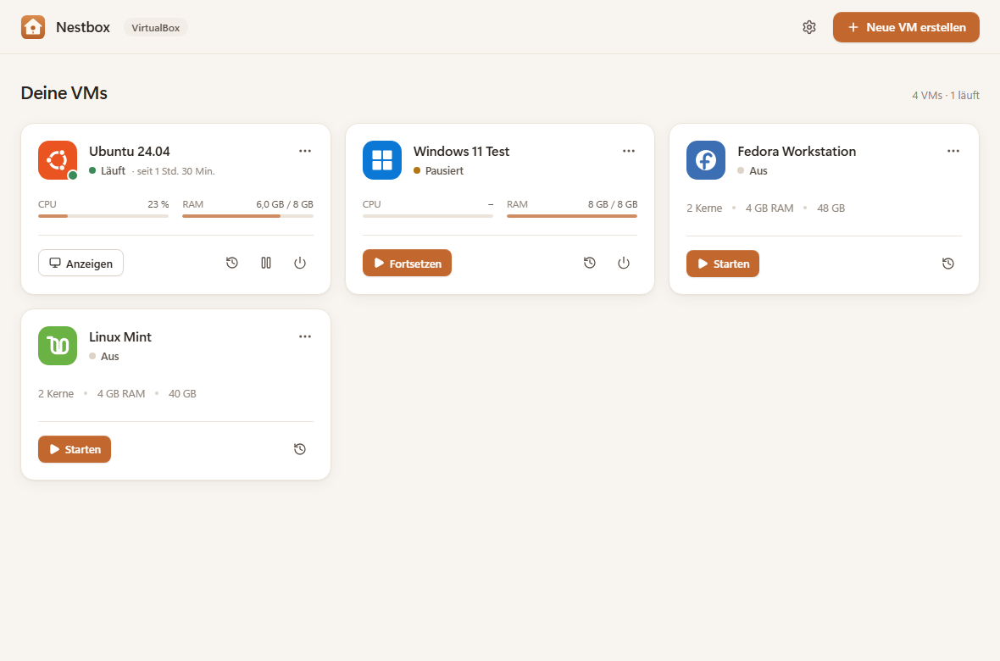
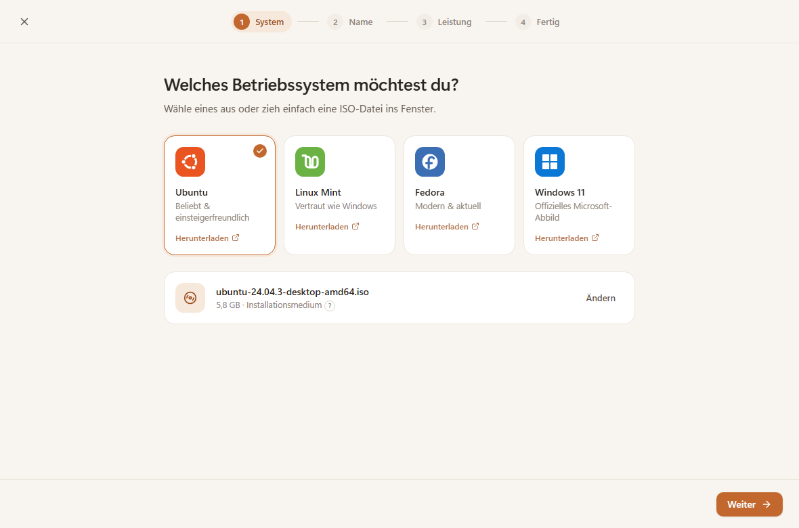
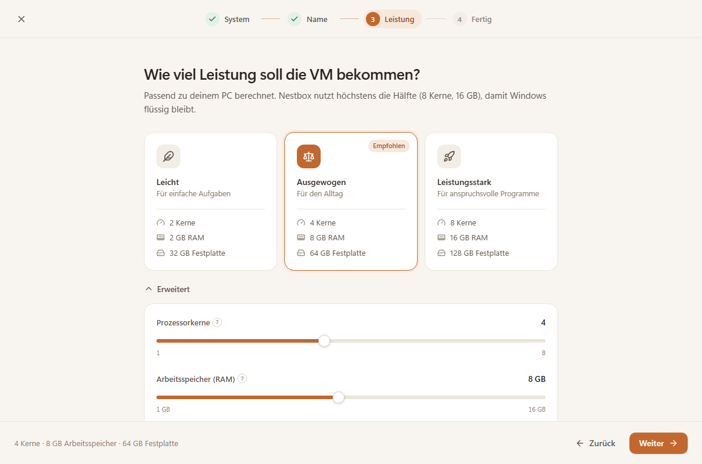
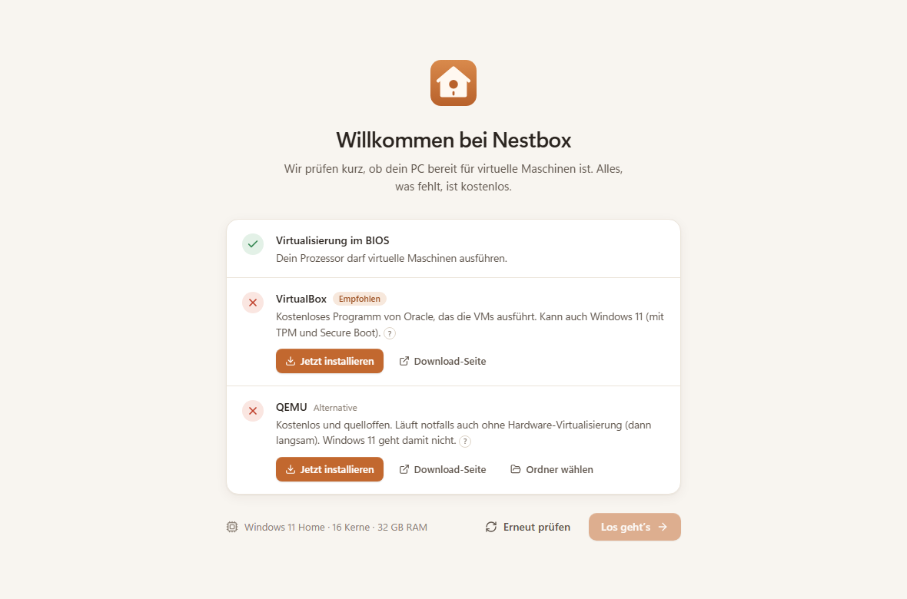
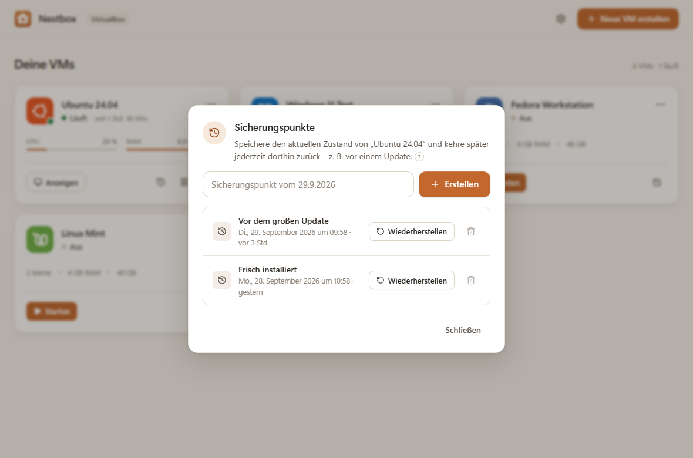

<div align="center">


# Nestbox

**Virtuelle Maschinen einfach gemacht – komplett kostenlos.**

Linux oder Windows neben deinem Windows ausprobieren: Betriebssystem wählen, ISO reinziehen, fertig.<br>
Kein Vorwissen, keine Pro-Lizenz, keine Kommandozeile.

<br>

[](https://github.com/MoinMornhart/Nestbox/releases/latest/download/Nestbox-Setup.exe)

<sub>Windows 10 & 11 · Home und Pro · 64 Bit · <a href="https://github.com/MoinMornhart/Nestbox/releases/latest">alle Downloads</a></sub>

<br>


<br>

<picture>
  <source media="(prefers-color-scheme: dark)" srcset="docs/bilder/hauptansicht-dunkel.png">
  
</picture>

</div>

<br>

## In unter einer Minute zur laufenden VM

1. **Nestbox installieren** – [Nestbox-Setup.exe](https://github.com/MoinMornhart/Nestbox/releases/latest/download/Nestbox-Setup.exe) herunterladen und doppelklicken.
2. **Einrichtung** – Nestbox prüft deinen PC und installiert auf Wunsch VirtualBox mit einem Klick.
3. **„Neue VM erstellen“** – Ubuntu, Linux Mint, Fedora oder Windows 11 wählen (oder eine eigene ISO reinziehen), Namen bestätigen, Leistung wählen.
4. **„Erstellen & starten“** – die VM startet, und du installierst das Betriebssystem wie auf einem echten PC.

## Was Nestbox kann

| | |
|---|---|
| 🪺 **Einfach** | Verständliche Sprache statt Fachbegriffe, Tooltips für alles Technische, jede Fehlermeldung mit konkretem Lösungsvorschlag. |
| 💸 **Kostenlos** | Läuft mit VirtualBox oder QEMU – beides kostenlos. Windows Home reicht, Hyper-V und Pro-Lizenz sind nicht nötig. |
| 🪟 **Windows 11 als Gast** | Mit VirtualBox inklusive TPM 2.0 und Secure Boot. |
| ⚡ **Passende Leistung** | „Leicht“, „Ausgewogen“ oder „Leistungsstark“ – automatisch aus deiner Hardware berechnet, nie mehr als die Hälfte deines PCs. |
| 🎬 **Flüssiges Bild** | 3D-Beschleunigung, Ton und Gasterweiterungen per Klick – für Videos und Streaming. |
| 🕰️ **Sicherungspunkte** | Zustand speichern und jederzeit zurückspringen, z. B. vor einem Update. |
| 🌗 **Hell & Dunkel** | Folgt automatisch deiner Windows-Einstellung. |

## So sieht es aus

<table>
  <tr>
    <td width="50%">
      <picture>
        <source media="(prefers-color-scheme: dark)" srcset="docs/bilder/assistent-1-iso-dunkel.png">
        
      </picture>
      <p align="center"><sub><b>Betriebssystem wählen</b> – Kachel antippen oder ISO reinziehen</sub></p>
    </td>
    <td width="50%">
      <picture>
        <source media="(prefers-color-scheme: dark)" srcset="docs/bilder/assistent-3-dunkel.png">
        
      </picture>
      <p align="center"><sub><b>Leistung wählen</b> – passend zu deinem PC berechnet</sub></p>
    </td>
  </tr>
  <tr>
    <td width="50%">
      <picture>
        <source media="(prefers-color-scheme: dark)" srcset="docs/bilder/einrichtung-dunkel.png">
        
      </picture>
      <p align="center"><sub><b>Einrichtung</b> – fehlende Programme mit einem Klick</sub></p>
    </td>
    <td width="50%">
      <picture>
        <source media="(prefers-color-scheme: dark)" srcset="docs/bilder/dialog-sicherungspunkte-dunkel.png">
        
      </picture>
      <p align="center"><sub><b>Sicherungspunkte</b> – zurück zu jedem gespeicherten Stand</sub></p>
    </td>
  </tr>
</table>

## Voraussetzungen

- **Windows 10 oder 11**, Home oder Pro, 64 Bit
- **Virtualisierung im BIOS/UEFI eingeschaltet** (Intel VT-x bzw. AMD-V/SVM) – Nestbox zeigt dir, falls nötig, wie es geht
- **VirtualBox** (empfohlen) oder **QEMU** – installiert Nestbox auf Wunsch selbst
- Genug freier Speicherplatz für die VMs (je VM etwa 20–80 GB, belegt wird nur, was wirklich genutzt wird)

<details>
<summary><b>Häufige Fragen</b></summary>

<br>

**Kostet Nestbox etwas?** Nein. Nestbox, VirtualBox und QEMU sind kostenlos.

**VirtualBox oder QEMU?** VirtualBox – es ist schneller, kann Windows 11 und liefert das flüssigere Bild. QEMU ist eine Alternative, die notfalls auch ohne Hardware-Virtualisierung läuft (dann langsam).

**Läuft Netflix in einer VM?** Ja, nach dem Installieren der Gasterweiterungen läuft Video flüssig. Wegen des Kopierschutzes liefern Streamingdienste in VMs aber meist höchstens HD (720p–1080p), kein 4K/HDR.

**Mein Windows läuft selbst in einer VM (z. B. Proxmox).** Dann muss der Host die Virtualisierung durchreichen – in Proxmox beim Prozessor den Typ „host“ wählen. Nestbox erkennt das und zeigt die Schritte an.

**Wo liegen meine VMs?** Standardmäßig unter `%USERPROFILE%\Nestbox\VMs\` – in den Einstellungen änderbar.

</details>

> [!NOTE]
> **Vorschau (0.9):** Oberfläche, Einrichtung und Verwaltung sind fertig. Das Starten echter VMs mit VirtualBox und QEMU wird gerade noch auf echter Hardware getestet. Fehler bitte als [Issue](https://github.com/MoinMornhart/Nestbox/issues) melden.

---

## Für Entwickler

<details>
<summary><b>Selbst bauen, Architektur und Mock-Modus</b></summary>

### Voraussetzungen zum Bauen

| Programm | Installation |
|---|---|
| Node.js LTS | `winget install OpenJS.NodeJS.LTS` oder [nodejs.org](https://nodejs.org) |
| Rust (stable) | `winget install Rustlang.Rustup` oder [rustup.rs](https://rustup.rs) |
| Visual Studio Build Tools mit „Desktopentwicklung mit C++“ | `winget install Microsoft.VisualStudio.2022.BuildTools --override "--wait --passive --add Microsoft.VisualStudio.Workload.VCTools --includeRecommended"` |
| Microsoft Edge WebView2 | Bei Windows 11 bereits enthalten, sonst `winget install Microsoft.EdgeWebView2Runtime` |

### Starten

Am einfachsten per Doppelklick auf **`start.bat`** – prüft alle Voraussetzungen, führt `npm install` aus und startet die App (`start.bat build` erzeugt den Installer).

```bash
npm install
npm run tauri dev      # Entwicklung
npm run tauri build    # Installer erzeugen → src-tauri/target/release/bundle/
```

Der erste Start dauert einige Minuten, weil Rust alles einmal kompiliert.

### Release veröffentlichen

Ein Tag wie `v0.9.0` pushen – der Workflow [„Installer bauen“](.github/workflows/release.yml) baut auf GitHub den Installer und hängt `Nestbox-Setup.exe` und `Nestbox.msi` ans Release. Der Link `…/releases/latest/download/Nestbox-Setup.exe` zeigt immer auf die neueste Version.

### Oberfläche im Browser (Mock-Modus)

`npm run dev` startet nur die Oberfläche auf http://localhost:1420. Außerhalb von Tauri antwortet ein simuliertes Backend mit Beispieldaten.

| URL-Parameter | Wirkung |
|---|---|
| `?mock=bereit` (Standard) | VirtualBox bereit, vier Beispiel-VMs |
| `?mock=leer` | Keine VMs |
| `?mock=einrichtung` | Weder VirtualBox noch QEMU installiert |
| `?mock=qemu` | Nur QEMU installiert |
| `?mock=vm` | Windows läuft selbst in einer VM ohne Virtualisierung |
| `?mock=neustart` | Neustart ausstehend |
| `?fail=start` / `?fail=create` / `?fail=snapshot` | Fehlermeldungen erzwingen |
| `?view=wizard&step=2` | Direkt in einen Assistenten-Schritt |

`npm run screenshots` nimmt (bei laufendem `npm run dev`) Vorschaubilder aller Bildschirme in hell und dunkel auf.

### Daten & Logs

| Was | Wo |
|---|---|
| App-Einstellungen | `%LOCALAPPDATA%\Nestbox\settings.json` |
| VM-Liste | `%LOCALAPPDATA%\Nestbox\vms.json` |
| Log-Datei (alle ausgeführten Befehle) | `%LOCALAPPDATA%\Nestbox\logs\nestbox.log` |
| VM-Dateien (Standard, änderbar) | `%USERPROFILE%\Nestbox\VMs\<Name>\` |

### Architektur

Tauri 2 (Rust) + React + TypeScript + Vite + Tailwind CSS.

```
src/                      Oberfläche
  lib/api.ts              einzige Verbindung zum Backend (Tauri-Commands)
  lib/mock.ts             simuliertes Backend für den Browser
  screens/                Einrichtung, Assistent, Hauptansicht, Dialoge
src-tauri/src/            Rust-Backend
  commands.rs             alle Tauri-Commands
  backend/mod.rs          Trait VmBackend + gemeinsame Helfer
  backend/vbox.rs         VBoxBackend (VBoxManage)
  backend/qemu.rs         QemuBackend (qemu-system, qemu-img)
  backend/qmp.rs          QMP-Client zur Steuerung laufender QEMU-VMs
  host.rs                 Einrichtungsprüfung, Installation per winget
  ps.rs                   PowerShell-Aufrufe (ohne Konsolenfenster, JSON-Ergebnisse)
  elevate.rs              Adminrechte per UAC nur bei Bedarf (elevated-command)
  store.rs / logger.rs    Einstellungen, VM-Liste, Log-Datei
```

Alle VM-Operationen laufen im Rust-Backend – nie direkt aus der Oberfläche. PowerShell wird mit `powershell.exe -NoProfile -NonInteractive -Command …` aufgerufen (Ergebnisse per `ConvertTo-Json`, gelesen mit serde), VirtualBox und QEMU direkt über ihre Kommandozeilenprogramme – immer ohne Konsolenfenster. Die App läuft ohne Adminrechte; eine UAC-Abfrage erscheint nur beim Installieren von VirtualBox/QEMU und beim Einschalten der Windows-Hypervisor-Plattform.

**VirtualBox:** UEFI, dynamische VDI-Festplatte am SATA-Controller, NAT-Netzwerk, USB-Tablet. Windows-Gäste mit TPM 2.0 und Secure Boot. 3D-Beschleunigung, 256 MB Grafikspeicher, HD-Audio, Nested Paging. Steuerung über `VBoxManage`, Status alle 2 Sekunden.

**QEMU:** `-machine q35`, `-accel whpx` (Fallback `tcg`), UEFI über edk2, qcow2-Festplatten, `usb-tablet`, HD-Audio. Steuerung über QMP (Pause, Herunterfahren, `savevm`/`loadvm`). Windows 11 ist ausgeblendet, weil QEMU unter Windows keinen TPM-Chip bereitstellen kann.

</details>
